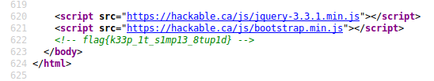
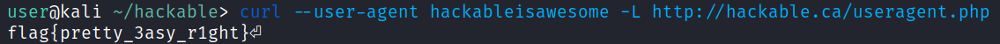
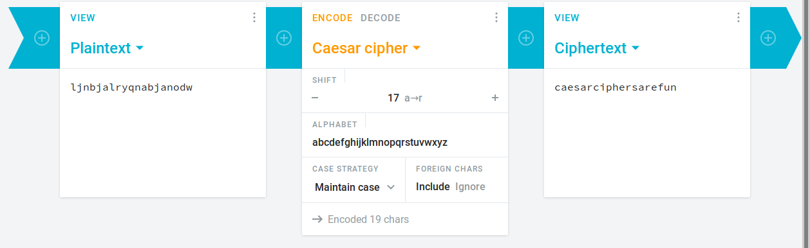
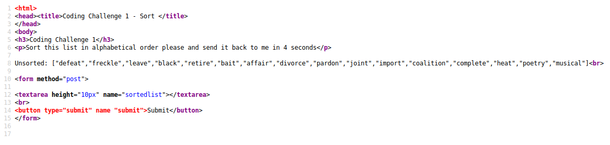
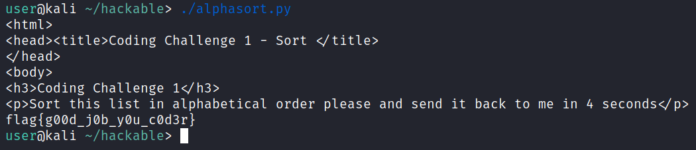

# Hackable
A writeup rep containing the challenges and solutions on hackable.ca

# Web Challenges

## kiss

For this challenge, click on the challenge tab and inspect the source code. The flag will be in a comment at the bottom of the source.



The flag for this challenge is `flag{k33p_1t_s1mp13_8tup1d}`

## user agent

For this challenge, you can use `curl` to send a request to the given URL with the custom user-agent string. 



The flag for this challenge is `flag{pretty_3asy_r1ght}`

# Crypto Challenges

## ciphers 1

For this challenge, decode the given text `ljnbjalryqnabjanodw` using any given caesar cipher decoder. The characters of the string are rotated 17 places. 



The flag for this challenge is `flag{caesarciphersarefun}`

# Coding challenges

## Coding Challenge 1

For this challenge, we are given an unsorted list with the goal being to sort then list, and then submit it. The list is random every time, so we can't sort it manually. If we look at the source code of the page, we can see some important pieces of information. 



Here, we can see that the unsorted list is stored in a line with the title `Unsorted`. Furthermore, we can send the sorted list via a POST request with the value having the title `sortedlist`. We can use the following Python script to achieve this. 

```python
#!/usr/bin/python3
import requests
import re
import json

s = requests.Session()
url = "http://coding.hackable.ca:8080"
r = s.get(url) # do a get request on the challenge page

for line in r.content.decode("utf-8").splitlines(): # decode the result of the get request 
    if re.search("Unsorted", line):
        list_items = re.findall('"([^"]*)"', line) # get each value inside quotations and put into a list
        json_string = json.dumps(sorted(list_items)).replace(' ', '') # put list into a JSON readable string
        data = {"sortedlist":json_string}
        r = s.post(url, data=data) # send a POST request of the end result
        print(r.text)
```



The flag for this challenge is `flag{g00d_j0b_y0u_c0d3r}`